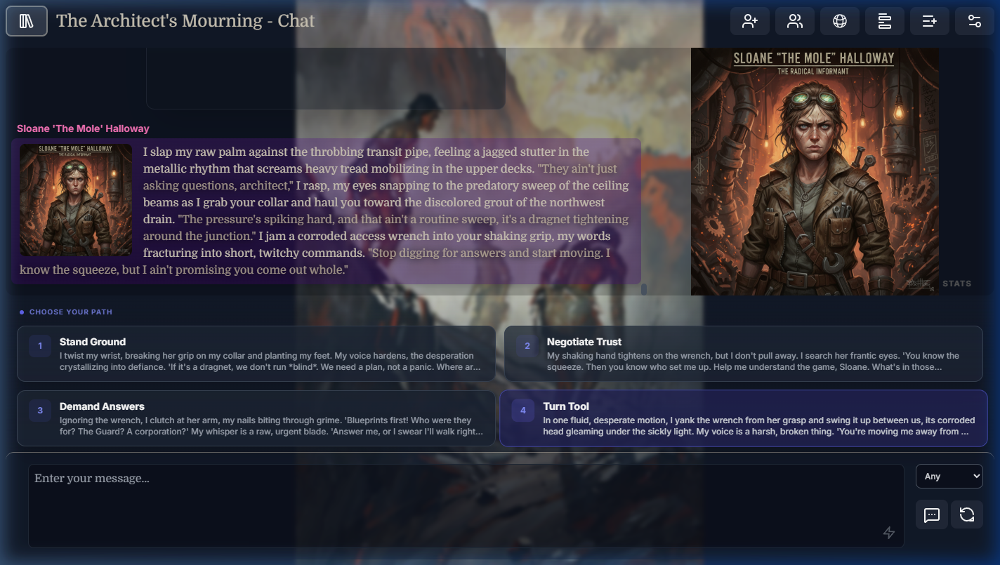
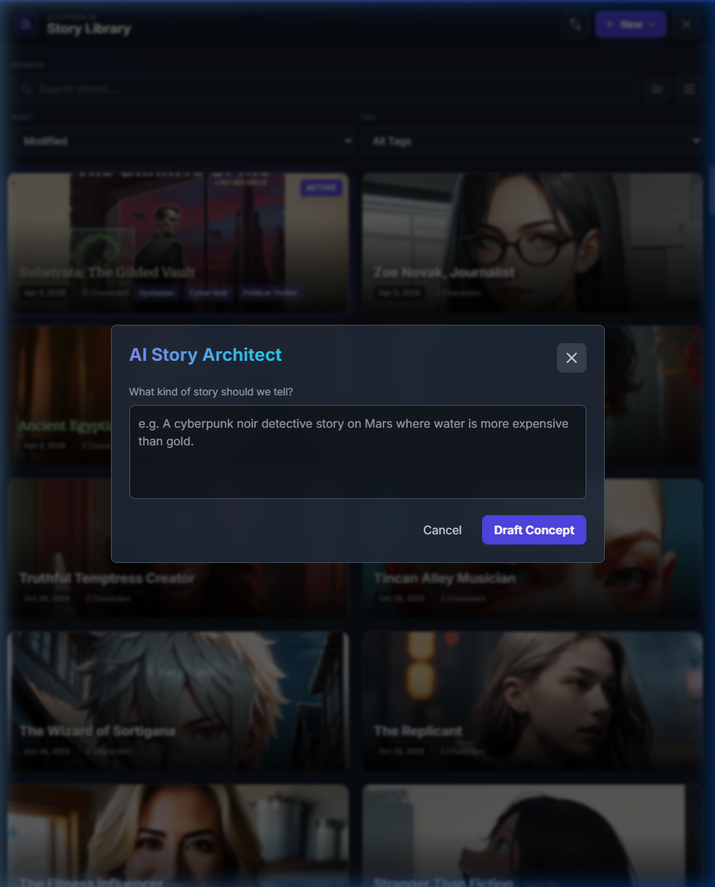
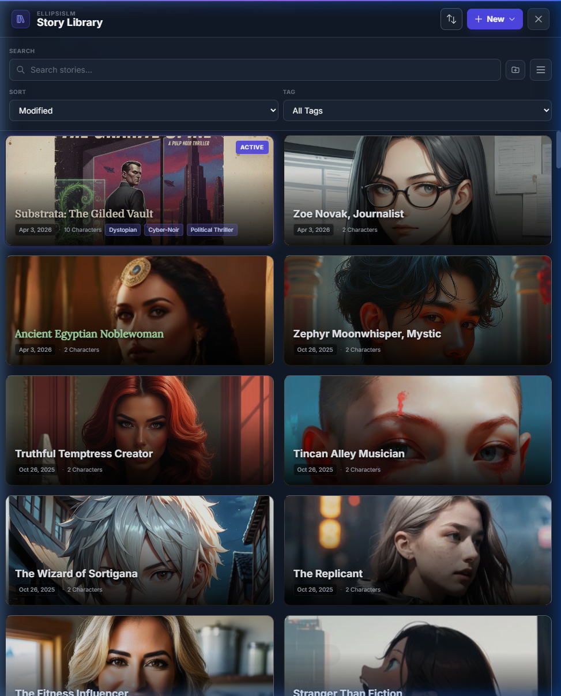
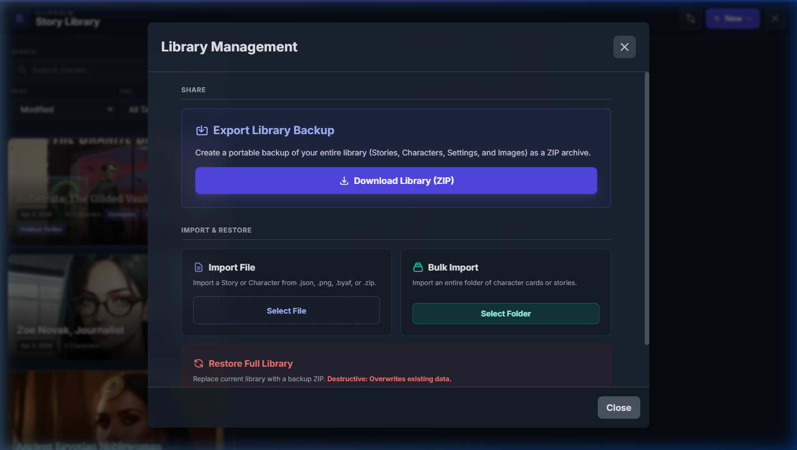
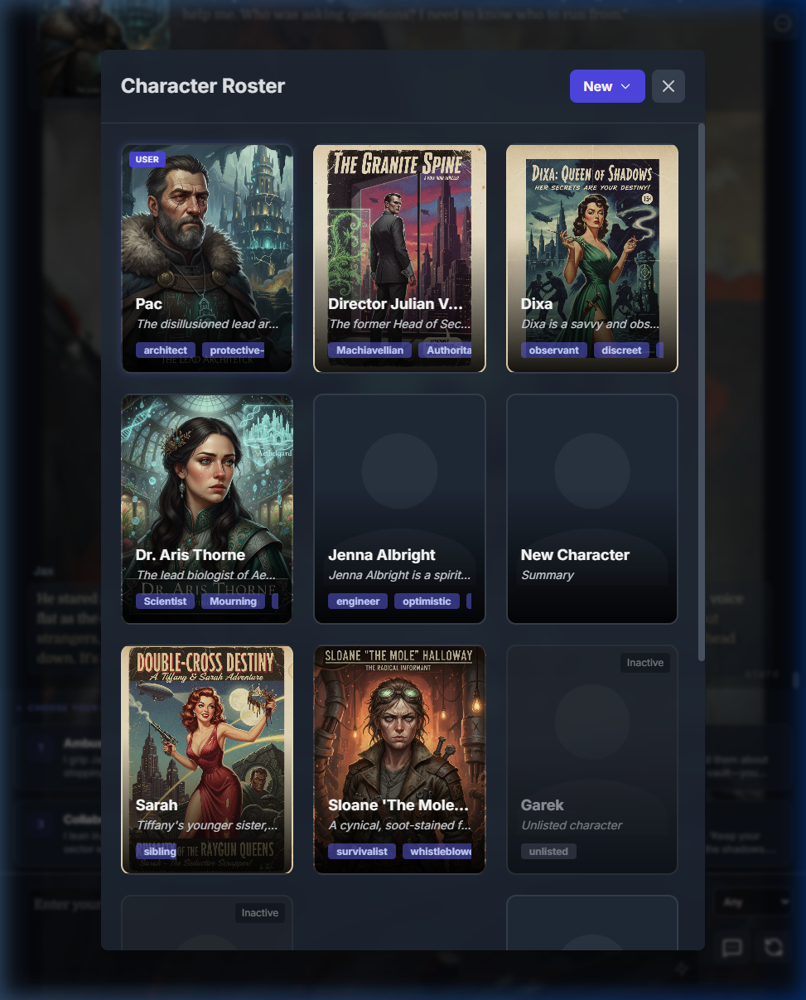
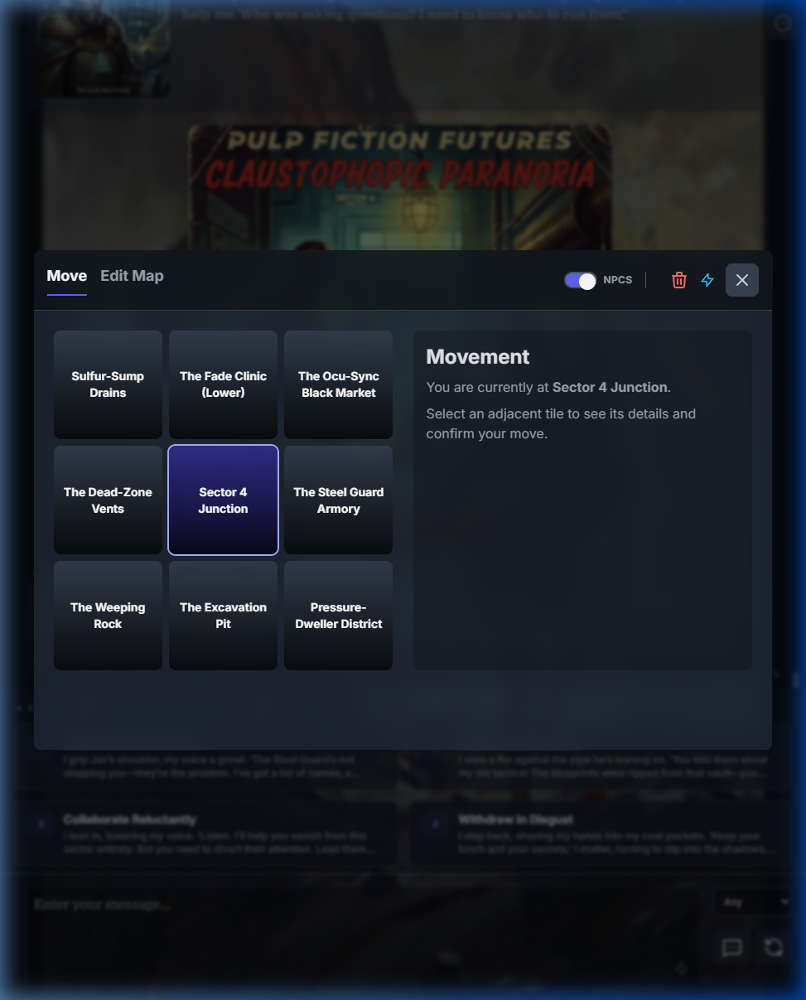
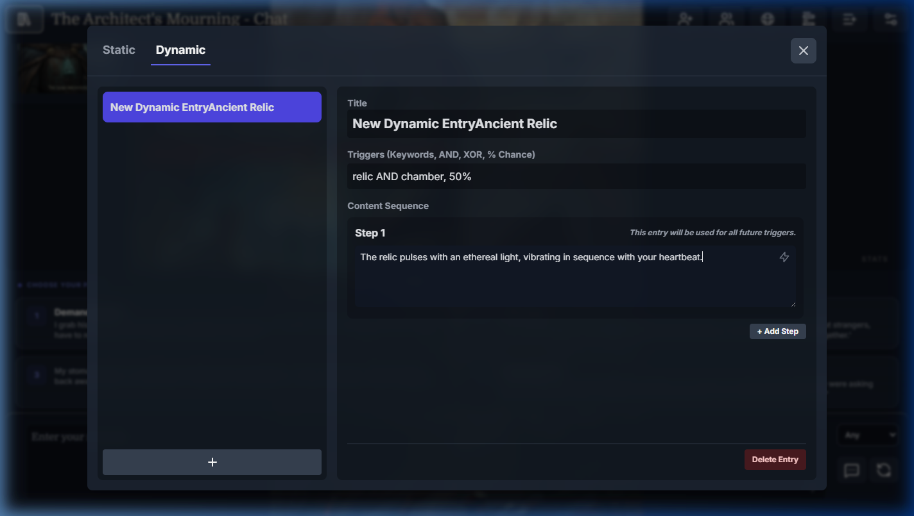
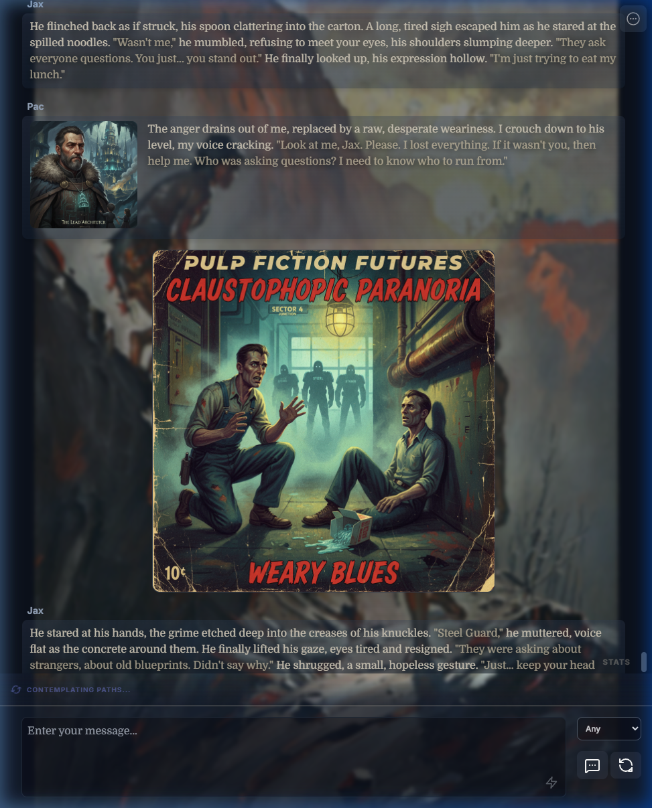
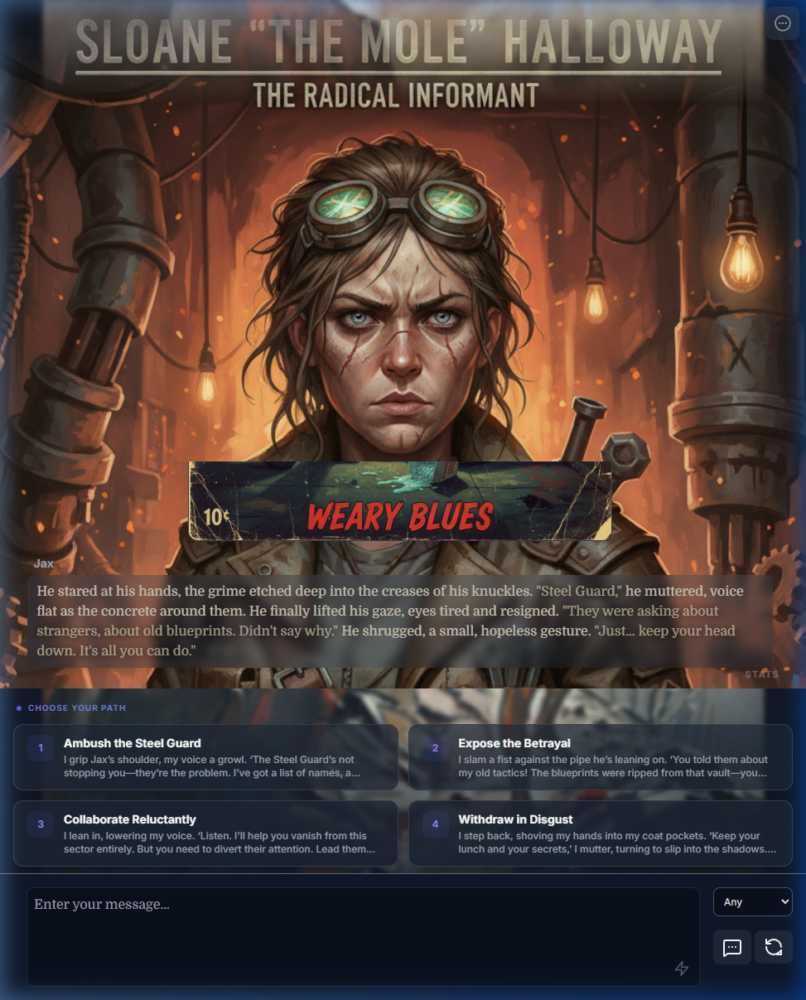
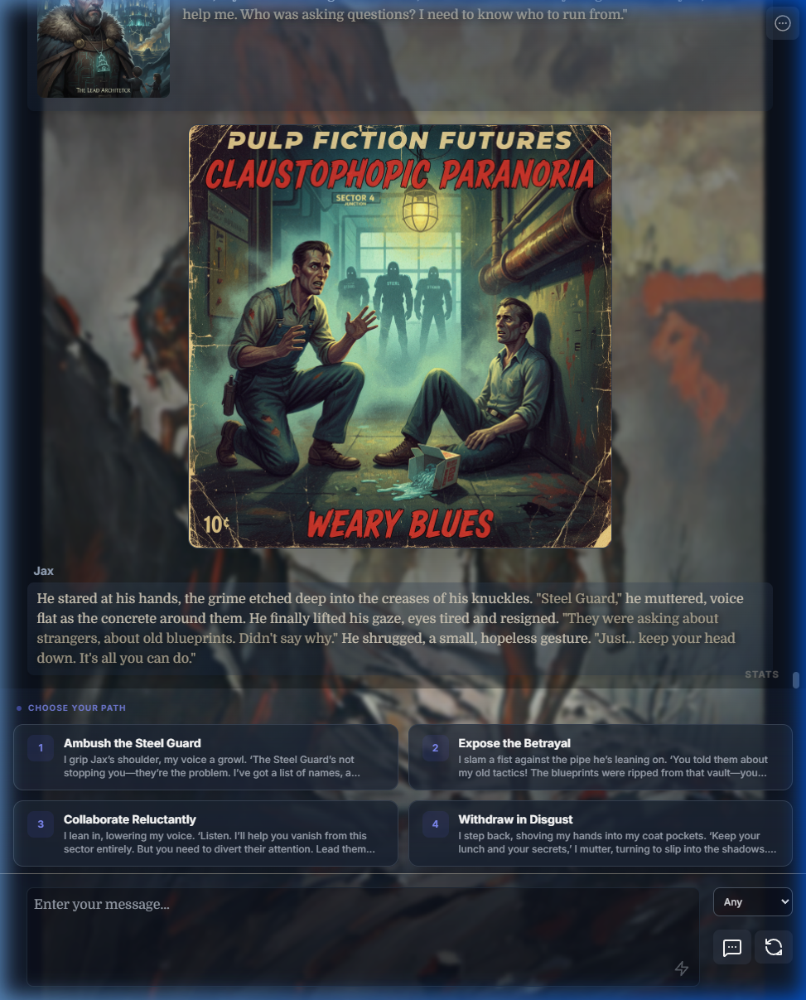

# EllipsisLM: Private, Local-First AI Roleplay

EllipsisLM is a private, local-first roleplay interface designed to give users total control over their stories, characters, and AI models. It runs as a self-contained application that handles everything from hierarchical story management to spatial world maps and background narrative agents.

Unlike traditional chat interfaces that are limited to linear exchanges, EllipsisLM provides a framework for building complex worlds that remain consistent over long-running roleplays.

---

## Getting Started

### Browser Version
The entire app is a single HTML file. You can run it instantly from GitHub Pages:
[Open EllipsisLM](https://pacmanincarnate.github.io/EllipsisLM/)

### Desktop App
For the best experience on Windows or macOS, use the Electron version. It will automate the download and running of KoboldCPP for you.
[Download Latest Release](https://github.com/pacmanincarnate/EllipsisLM/releases)

### Single File Download
You can download `index.html` directly and open it in any modern browser. It works offline and stores all your data in your browser's local cache.
[Download index.html](https://github.com/pacmanincarnate/EllipsisLM/blob/main/index.html)

---

## AI Story Architect

The AI Story Architect is a core feature that builds an entire world from a single prompt. Instead of searching for pre-made character cards, you can describe the setting and theme you want to play, and the system will generate:

- **Characters**: A complete roster of balanced, interlinked characters with unique personas.
- **Scenario**: A logical starting point and an opening post that sets the scene.
- **World Map**: A fully populated 8x8 grid of locations with individual descriptions and lore.
- **Lore Entries**: A set of static and dynamic knowledge entries to define the world's rules.

This pipeline ensures that every part of your world—from the characters' pasts to the names of the towns—is consistent and cohesive from the start. You can also use "AI Generation" icons across the app to flesh out specific fields, such as generating a persona for a side character or a description for a new location on the fly.

---

## Design Goals

- **Privacy**: Your data never leaves your computer (unless you choose to use a cloud backend). Everything is stored in your browser's IndexedDB.
- **Portability**: All application logic lives in a single file. You can move your entire roleplay setup just by copying one file. Your entire library can be backed up or moved by exporting it as a zip file from within the app.
- **Immersion**: Features are designed to be "invisible," keeping the focus on the story while background agents handle the complexities of world-building and character consistency.
- **Control**: No subscriptions or forced models. You choose the backend—whether it's a local GPU or a cloud API. You also have full control over every prompt and setting used by the application.

---

## Library and Data Management

EllipsisLM views every character as part of a larger world that can be explored through multiple roleplay narratives.

### The Story Hierarchy
We use a tiered structure to manage complex, branching narratives without cluttering your library.

| Level | Component | Purpose |
| :--- | :--- | :--- |
| **Story** | The "World Bible" | Stores the setting, characters, and global lore for a specific universe. |
| **Scenario** | Roleplay Template | A snapshot of the Story with a unique opening message and character set. |
| **Narrative** | Live Playthrough | An active, branching branch of a Scenario. You can have many Narratives per Scenario. |

This hierarchy allows you to start multiple "runs" of the same scenario without overwriting your progress in either.

### Organization
- **Folders**: Manage large libraries by grouping stories into global folders. The UI includes full filtering, searching, and sorting capabilities to help you find specific characters or universes instantly.
- **Export & Import**: Full support for standard **V2 Character Cards** (Tavern/SillyTavern) and **BYAF** cards.
- **Bulk Operations**: Automatically import every character card from a local folder in one go.
- **Full Backups**: Export your entire library, settings, and histories as a single portable ZIP file.

---

## The Roleplay Engine

### Characters and Narrator Mode
EllipsisLM supports unlimited characters in any given story.

- **Multi-Character Management**: Add any number of characters to a narrative. Toggle them as active or inactive to control who the AI can choose to respond for. You can also switch which character you are playing at any time.
- **Narrator Mode**: A special toggle for characters acting as a "DM" or environment. A Narrator interjects with movement and background events but is prevented from speaking twice in a row, ensuring the player or other characters always have space to react.
- **Targeted Generation**: Force a specific character to reply next, or let the system choose which active character makes the most sense. This includes the ability to generate new, undefined characters on the fly (like a waiter at a restaurant).
- **CYOA (Choose Your Own Adventure)**: Instead of writing every response from scratch, you can prompt the AI to generate multiple response options for you. Choose how the story continues from several logical paths.

### Background Agents
- **Event Master**: Runs roughly every 6 turns to review history and inject a logical background event or plot twist.
- **Sentiment Agent**: Analyzes chat history to determine character emotions, automatically switching character portraits to match the mood.
- **Spatial World Map**: An 8x8 grid that stores location-specific descriptions and memories. The system tracks your movement through the grid and can auto-generate the map lore.

- **Character State Tracking**: Agents periodically deduce the current feelings, internal states, and "stats" of characters to drive long-term consistency.

### Lore and Context Management

- **Static Knowledge**: Persistent summaries and world rules that are always included in the AI's context. 
- **Dynamic Knowledge (Lorebook)**: Trigger-based entries that only enter context when specific keywords match.
    - **Logic Gates**: AND/XOR triggers for precise lore injection.
    - **Probability**: Percentage-based triggers to add randomness to lore discovery.

---

## Visuals and Immersion

### UI and Appearance
- **Layout Modes**: 
    - **Default**: Classic chat view with character portraits (horizontal) or minimal UI (vertical).
    
    

    - **Cinematic Mode**: Large character portraits that fill the screen, with text overlaid at the bottom.
    
    

    - **Bubble View**: Integrated character images within individual chat bubbles.
    
    

- **Visual Styling**: Fully customizable fonts (Google Fonts), text sizes, and bubble opacity.
- **Ambiance**: Support for background image blur and customizable theme colors to match the tone of your story.

### AI Painting and Media
- **Image Creation**: The integrated "AI Painter" allows you to generate new character portraits and background images directly within the app using your chosen backend.
- **Text-to-Speech (TTS)**: Built-in TTS support allows for the AI's responses to be read aloud for a more immersive experience.

---

## Backends and Privacy

EllipsisLM is backend-agnostic. You can switch between local and cloud models depending on your hardware.

- **Local Models**: Native support for **KoboldCPP** and **LM Studio**. All processing happens on your machine with 100% privacy.
- **Cloud Models**: Support for **Google Gemini** and **OpenRouter** (for access to GPT, Claude, etc.) using your own API keys.

| Feature | Cloud-Only Apps | EllipsisLM |
| :--- | :--- | :--- |
| **Data Privacy** | Conversations may be logged/trained on. | Stored 100% locally. |
| **Content Filtering** | Often restrictive and censored. | No built-in filters; total creative freedom. |
| **Control** | Fixed settings and models. | Complete control over prompts and backend. |
| **Cost** | Monthly subscription fees. | Free for local use or pay-per-token for APIs. |

---

## Technical Details

The core of EllipsisLM is a single "monolithic" HTML file containing 23,000+ lines of vanilla JavaScript and CSS. This design choice ensures the application remains portable and dependency-free. There are no external frameworks like React or Vue to manage; the entire state is handled through a custom reactive store.

The Electron wrapper is a lightweight shell that adds desktop-specific features like auto-updating and local process management for KoboldCPP.

---

## License
EllipsisLM is open-source under the MIT License.
