# EllipsisLM: Private, Local-First AI Roleplay

EllipsisLM is a private, local-first roleplay interface designed to give users total control over their stories, characters, and AI models. It runs as a self-contained application that handles everything from hierarchical story management to spatial world maps and background narrative agents.

Unlike traditional chat interfaces that are limited to linear exchanges, EllipsisLM provides a framework for building complex worlds that remain consistent over long-running roleplays.

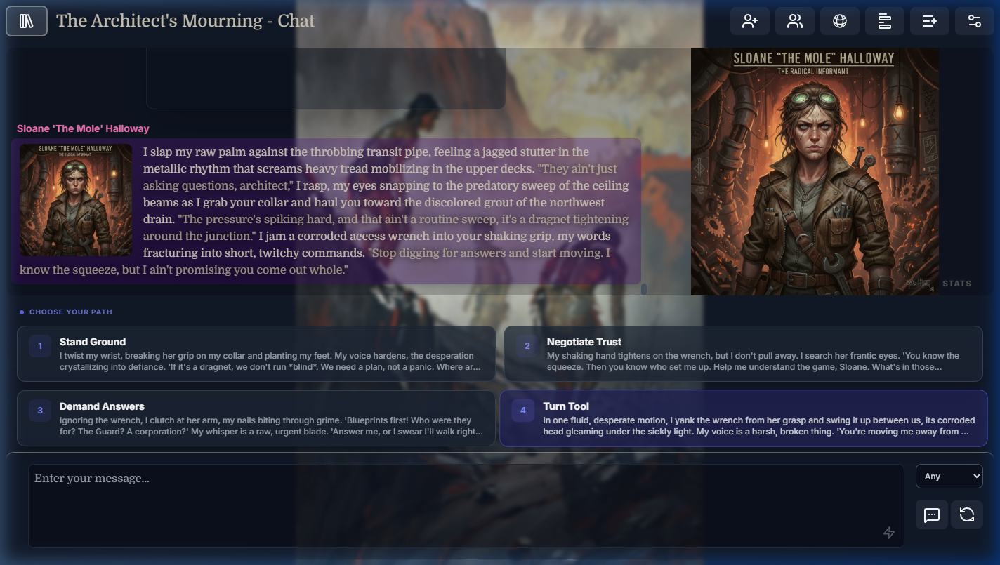

---

## Getting Started

### Browser Version
The entire app is a single HTML file. You can run it instantly from GitHub Pages:
[Open EllipsisLM](https://pacmanincarnate.github.io/EllipsisLM/)

### Desktop App
For the best experience on Windows or macOS, use the Electron version. It will automate the download and running of KoboldCPP for you.
[Download Latest Release](https://github.com/pacmanincarnate/EllipsisLM/releases)

### Single File Download
You can download `index.html` directly and open it in any modern browser. It works offline and stores all your data in your browser's local cache.
[Download index.html](https://github.com/pacmanincarnate/EllipsisLM/blob/main/index.html)

---

## AI Story Architect

The AI Story Architect is a core feature that builds an entire world from a single prompt. Instead of searching for pre-made character cards, you can describe the setting and theme you want to play, and the system will generate:

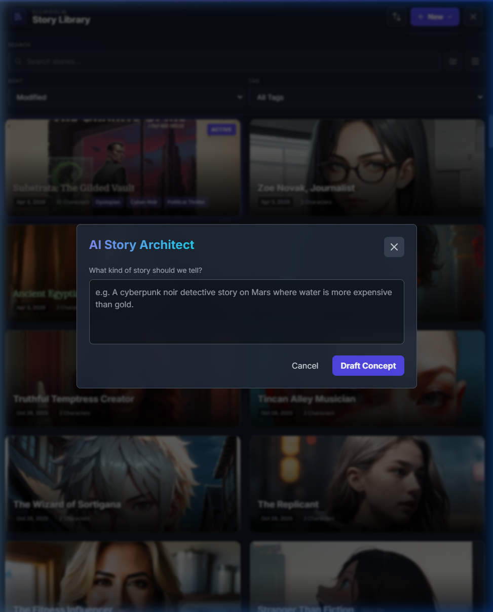

- **Characters**: A complete roster of balanced, interlinked characters with unique personas.
- **Scenario**: A logical starting point and an opening post that sets the scene.
- **World Map**: A fully populated 8x8 grid of locations with individual descriptions and lore.
- **Lore Entries**: A set of static and dynamic knowledge entries to define the world's rules.

This pipeline ensures that every part of your world—from the characters' pasts to the names of the towns—is consistent and cohesive from the start. You can also use "AI Generation" icons across the app to flesh out specific fields, such as generating a persona for a side character or a description for a new location on the fly.

---

## Design Goals

- **Privacy**: Your data never leaves your computer (unless you choose to use a cloud backend). Everything is stored in your browser's IndexedDB.
- **Portability**: All application logic lives in a single file. You can move your entire roleplay setup just by copying one file. Your entire library can be backed up or moved by exporting it as a zip file from within the app.
- **Immersion**: Features are designed to be "invisible," keeping the focus on the story while background agents handle the complexities of world-building and character consistency.
- **Control**: No subscriptions or forced models. You choose the backend—whether it's a local GPU or a cloud API. You also have full control over every prompt and setting used by the application.

---

## Library and Data Management

EllipsisLM views every character as part of a larger world that can be explored through multiple roleplay narratives.

### The Story Hierarchy
We use a tiered structure to manage complex, branching narratives without cluttering your library.

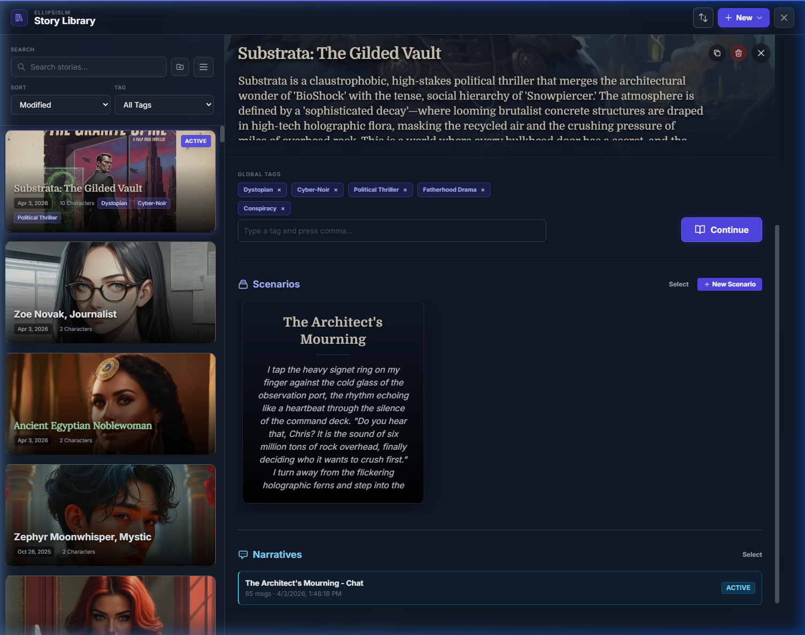

| Level | Component | Purpose |
| :--- | :--- | :--- |
| **Story** | The "World Bible" | Stores the setting, characters, and global lore for a specific universe. |
| **Scenario** | Roleplay Template | A snapshot of the Story with a unique opening message and character set. |
| **Narrative** | Live Playthrough | An active, branching branch of a Scenario. You can have many Narratives per Scenario. |

This hierarchy allows you to start multiple "runs" of the same scenario without overwriting your progress in either.

- **Scenario Editor**: Customize scenarios with specific notes, active character rosters, and scenario-specific lore. Create new blank scenarios or edit existing templates directly from the UI.
- **Player Tab**: Choose a portrait and set your character's name, gender, pronouns, backstory, current appearance, ancestry, and class/role when editing a scenario. Each playthrough starts with its own copy. During play, **Player** opens character information in the journal and inventory panel. **Scenario Settings**, alongside Player and Inventory in the composer toolbar, holds feature toggles and time/survival pacing.
- **Update Character**: Expand **Update character** in the Player tab to record a current form, injuries, and ongoing effects. For each known NPC, record whether they recognize you and whether they witnessed the change. Changing form clears the editor's old recognition assumptions so you can set them for the new body. **Save Player** saves these edits locally without an AI call; they are included in subsequent standard and Swarm prompts. NPCs are not assumed to know a transformation's cause or the player's secrets. These are manual updates, scoped to the current playthrough.
- **Optional Player Stats**: Enable six ability scores (Strength, Dexterity, Constitution, Intelligence, Wisdom, and Charisma), level, HP, and armor class. During play, ability and survival values appear in a separate **Stats** tab when either system is enabled. Values are read-only until you explicitly select **Override stats**; saving, leaving the tab, or reloading locks them again. Scenario creation still lets you set initial values. Turning a system off keeps its saved values.
- **Optional RPG Progression**: Enable **RPG progression** in scenario creation or live **Scenario Settings**. It is off by default. Progression uses player stats; dice remain a separate opt-in. Each attribute starts at **8**, with **12 starting attribute points** and **2 points per level above level 1** by default. Configure the starting level, starting pool, points per level, and an optional maximum level; a blank maximum is unlimited. The starting level applies when a run starts or progression is first enabled. Spend points with **+** in the scenario editor or live **Stats** tab; an explicit stats override enables refunds for redistribution. Successful real rolls earn **DC × 10 XP** and failed rolls earn **5 XP**. Skips earn none. Each level costs **100 × current level XP**, and level-ups grant the configured points. XP is awarded once per roll, remains recorded across narration retries, and rewinds with a removed roll. These calculations make no AI calls.
- **NPC Progression Rules**: When RPG progression is enabled, discovered, authored, and map NPCs all use the same base scores, point budget, and level cap. A level-5 NPC has the starting pool plus four levels of points, allocated locally with occupation-based weights. NPC level/attribute fields are locked, and repeated introduction flags cannot raise an established level. These rules are applied through saved, per-playthrough NPC progression records without rewriting the original character templates. Changing the point rules reconciles every NPC budget; switching progression off restores their ordinary sheets and preserves the progression records. NPCs enter at their established or locally generated level; their prior training is represented by that level.
- **Automatic Game Time**: A compact clock sits under the story title on desktop and beside the menu on mobile. Click it to expand elapsed time and turn details, or open **Scenario Settings** to change the pace, starting hour, or pause time. By default, a new playthrough begins on **Day 1 at 08:00**, and each completed story turn advances **15 minutes**. Existing playthroughs begin tracking from their next completed turn. A multi-character response counts once; retries, message edits, dice requests/results, private texts, failed generations, and idle time do not advance the clock. Rewinding the latest story turns restores their time.
- **Optional Survival Stats**: Enable water, sleep, and food in the scenario's **Player** tab or the live **Scenario Settings**. A compact **Survival** toggle beside the clock expands three meters with percentages and low/critical indicators. Enabled meters decline automatically with in-game time: by default, water loses **4**, food **3**, and rest **5 percentage points per hour**. Change pacing rates in Scenario Settings; click a meter to view its level in **Stats**, where corrections require **Override stats**. The narrator can report completed meals, drinks, sleep, and longer time skips; the app applies those changes once. Recovery and time skips depend on your model following the narrator instructions; ordinary turn progression and depletion run locally. Survival is off by default, works independently of abilities, dice, and the journal, and preserves its values when disabled. Pausing game time also pauses automatic survival changes.
- **Survival Penalties**: With both player stats and survival enabled, each need imposes **−1 at 25% or below**, **−2 at 10% or below**, and **−3 at 0%**. Thirst affects all six abilities; hunger affects Strength, Dexterity, and Constitution; fatigue affects Dexterity, Intelligence, Wisdom, and Charisma. Applicable penalties stack on the ability check modifier. Base scores, HP, and armor stay unchanged. Penalties appear in Stats, the compact meters, and the roll breakdown, and clear automatically as needs recover. Roll history retains the modifier used at the time. Turning off player stats or survival removes the penalties; untyped d20 checks remain unmodified. All calculations run locally.
- **Optional d20 Checks**: Enable dice separately from stats. Before narrating the outcome of a player action, the configured model assesses whether it needs an ability check using the scene context. Meaningful persuasion, investigation, stealth, perception, physical feats, and endurance use the appropriate ability; ordinary conversation and trivial actions proceed without a roll. Difficulty is set before the app rolls. An animated d20 occupies the right side of the composer, and the action, target, and outcome temporarily replace the typing area. The app records a result card and automatically continues the scene using that outcome. Draft text is preserved. Stats add the relevant ability modifier; with stats off, checks use a straight d20. Stopping or skipping remains available. The graphics and random roll run locally. A red warning beside the toggle explains that action assessment uses an extra AI call before narration, even when it decides no roll is needed. A check requested during narration requires a further response to continue. This is a lightweight ability-check system, inspired by the [D&D basic rules](https://www.dndbeyond.com/sources/dnd/br-2024/playing-the-game), rather than a full combat implementation.

### Organization
- **Folders**: Manage large libraries by grouping stories into global folders. The UI includes full filtering, searching, and sorting capabilities to help you find specific characters or universes instantly.
- **Discover Feature (Beta)**: Search and import characters directly from **Chub.ai** (works in-browser without Electron) or **Backyard.ai** (installed version), or import character/scenario links from **fictionlab.ai**.
- **Export & Import**: Full support for standard **V2 Character Cards** (Tavern/SillyTavern) and **BYAF** cards. Automatic image cache hydration and story opening on import.
- **Bulk Operations**: Automatically import every character card from a local folder in one go.
- **Full Backups**: Export your entire library, settings, and histories as a single portable ZIP file.

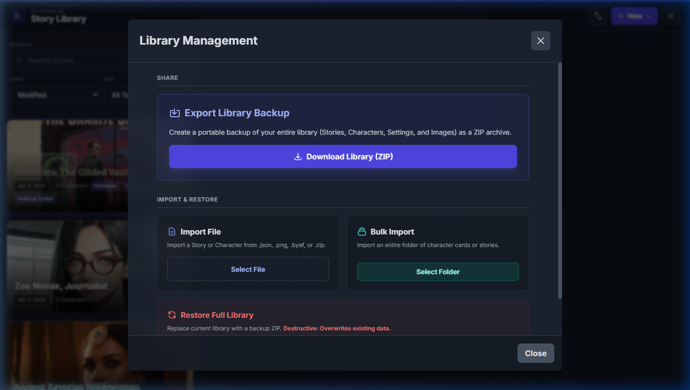

---

## The Roleplay Engine

### Characters and Narrator Mode
EllipsisLM supports unlimited characters in any given story.

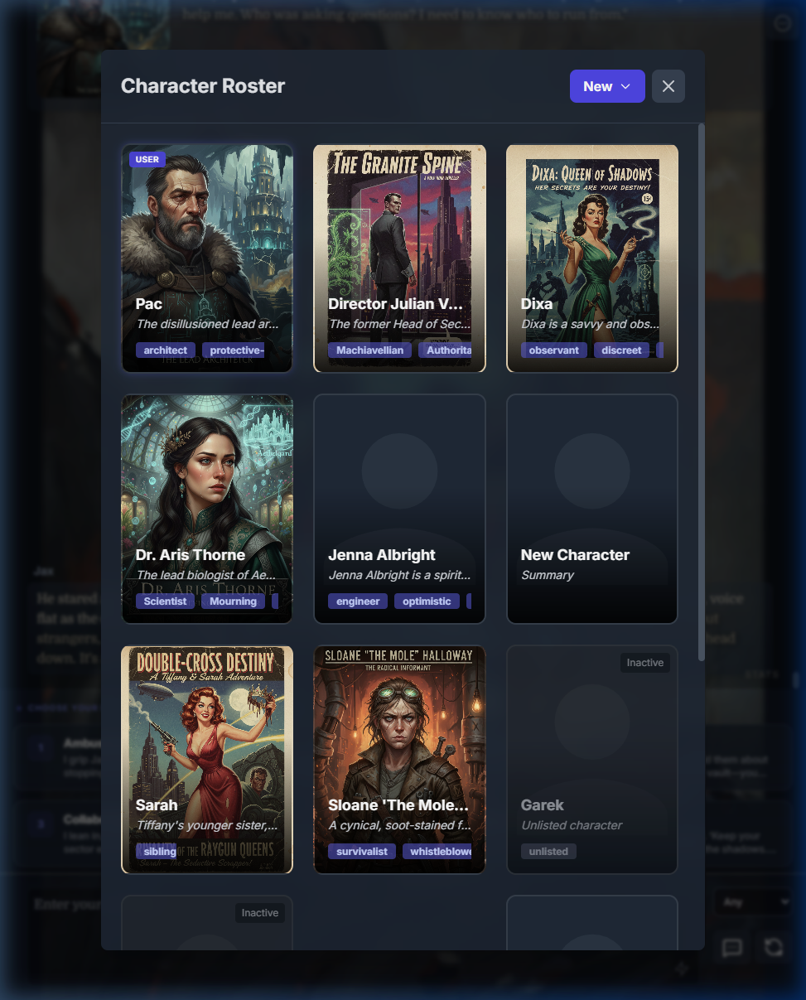

- **Multi-Character Management**: Add any number of characters to a narrative. Toggle them as active or inactive to control who the AI can choose to respond for. You can also switch which character you are playing at any time.
- **Automatic Character Discovery**: Named people introduced in completed story responses are added to the roster automatically. The normal story response uses `[NPC_MET: name|occupation|physical description]` for a person you meet and `[NPC_MENTION: name|occupation]` for someone only talked about. Mentions create an entry without a physical description. On meeting that person later, local matching updates the same entry and the AI supplies a concise physical description in that same response, preserving existing stats and edits. Existing characters with missing descriptions can be filled on their next meeting. No separate description request is made. Legacy `[NPC: name|occupation]` flags remain supported. Text rules also recognize introductions, occupation titles, dialogue, personal actions, and short answers to name questions; unnamed people, place names, and explicitly unintelligible commands are excluded. Matching and stat/personality generation run locally; descriptions add a small amount of text to the normal story response without another AI call. Older visible story messages are also checked when you reopen a playthrough.
- **Character Sheets**: Open a discovered character's roster card to see whether they have been met or only mentioned, read/edit their physical description, and view/edit their occupation, six ability scores, level, health, armor, personality, temperament, motivation, and mannerisms, or upload a portrait. These values use stable local randomness, weighted by occupation. Later appearances preserve the same sheet and your edits; learning an unknown occupation fills in unedited values. Known details and encounter excerpts remain available, and the narrator receives the saved sheet as context. Discovered characters belong to that playthrough and start inactive, so adding a name does not force an extra speaker into the scene. Deleted discoveries stay removed. Existing authored characters also have a **Create Character Sheet** button.
- **Narrator Mode**: A special toggle for characters acting as a "DM" or environment. A Narrator interjects with movement and background events but is prevented from speaking twice in a row, ensuring the player or other characters always have space to react.
- **Targeted Generation**: Force a specific character to reply next, or let the system choose which active character makes the most sense. This includes the ability to generate new, undefined characters on the fly (like a waiter at a restaurant).
- **AI Character Directives**: Inject specific behavioral instructions or plot guidance for a character's next generation using a right-click context menu on the chat interface.
- **Vision & Image Input (Beta)**: Send images along with your messages. Characters will analyze and understand the image contents (requires a vision-capable model like Gemini or supported OpenRouter models).
- **CYOA (Choose Your Own Adventure)**: Instead of writing every response from scratch, you can prompt the AI to generate multiple response options for you. Choose how the story continues from several logical paths.
- **Chat History Cycling**: Quickly cycle through your last 3 sent messages using the `Up Arrow` key in the chat input for faster editing and resending.

### Background Agents
- **Event Master**: Runs roughly every 6 turns to review history and inject a logical background event or plot twist.
- **Sentiment Agent**: Analyzes chat history to determine character emotions, automatically switching character portraits to match the mood.
- **World Map, Places, and Local Areas**: Browse the whole known world, click into regions and settlements, then open their inns, gates, shops, districts, and other areas. Breadcrumbs show where each place belongs and mark your current location. Existing grid locations, descriptions, lore, portraits, and character links carry into this view; the original movement grid remains under **Grid editor**.
- **Automatic Place Discovery**: Named places are collected from completed story responses. Local text rules work without an extra AI request; short place and arrival tags in the normal response help record names and parent locations accurately. Descriptions reuse nearby story prose. Mentions and travel plans do not move the player. You can correct names, nesting, descriptions, notes, and the current location directly in the map.
- **Local Memories**: Places retain relevant story excerpts and links to mentioned characters. The narrator receives the current location, its parent places, relevant descriptions, local notes, and recent events instead of the entire world history. Map discoveries and edits belong to their playthrough.
- **Place Pictures**: With a configured image provider, new discoveries get one automatic picture request each, queued one at a time. Pictures stay blank when no provider is configured. Upload your own image or use **Generate picture** whenever wanted; **Auto pictures** controls automatic generation. Saved pictures are reused, and a provider failure pauses the automatic queue for the session.

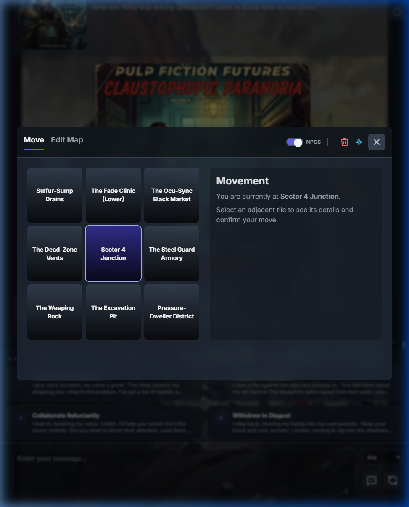

- **Character State Tracking**: Agents periodically deduce the current feelings, internal states, and "stats" of characters to drive long-term consistency.
- **Player Inventory**: Open your items directly with the **Inventory** button in the composer toolbar on desktop or mobile. Quests and relationships are available in the same panel when journal tracking is enabled.

### Lore and Context Management
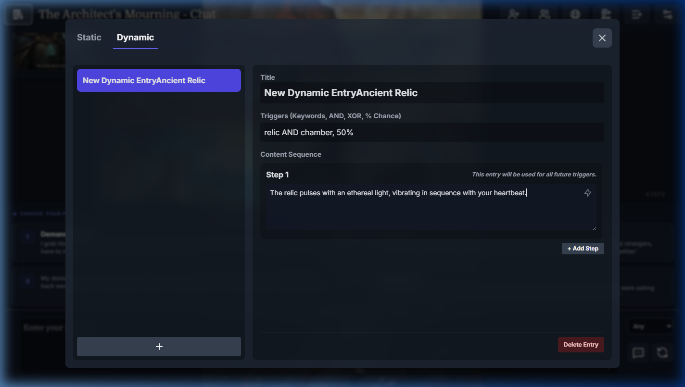

- **Character-Specific Knowledge**: Define dynamic lore/knowledge entries directly within a character's description that are only visible to and used by that specific character (perfect for secrets and private motives!).
- **Static Knowledge**: Persistent summaries and world rules that are always included in the AI's context. 
- **Dynamic Knowledge (Lorebook)**: Trigger-based entries that only enter context when specific keywords match.
    - **Logic Gates**: AND/XOR triggers for precise lore injection.
    - **Probability**: Percentage-based triggers to add randomness to lore discovery.

---

## Visuals and Immersion

### UI and Appearance
- **Layout Modes**: 
    - **Default**: Classic chat view with character portraits (horizontal) or minimal UI (vertical).
    
    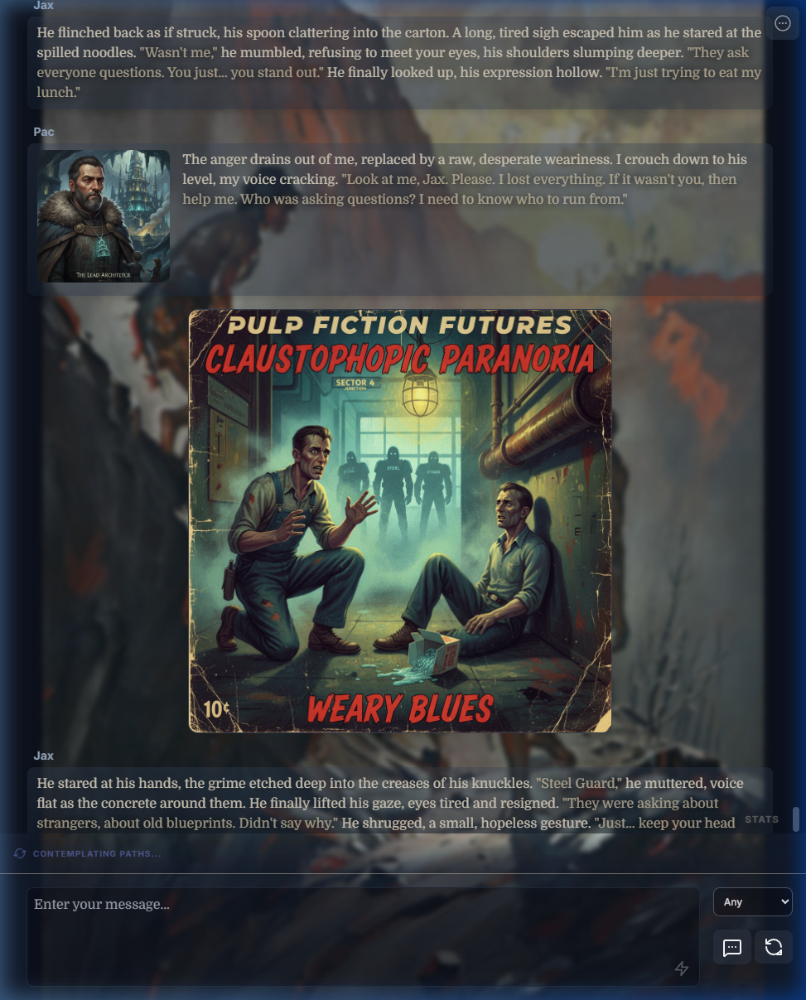

    - **Cinematic Mode**: Large character portraits that fill the screen, with text overlaid at the bottom.
    
    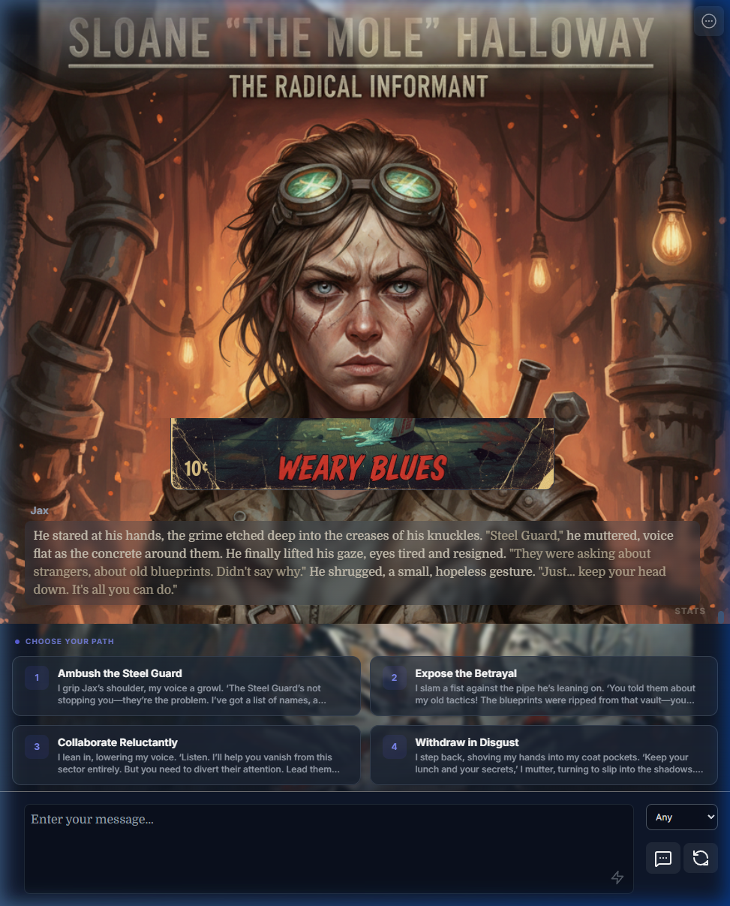

    - **Bubble View**: Integrated character images within individual chat bubbles.
    
    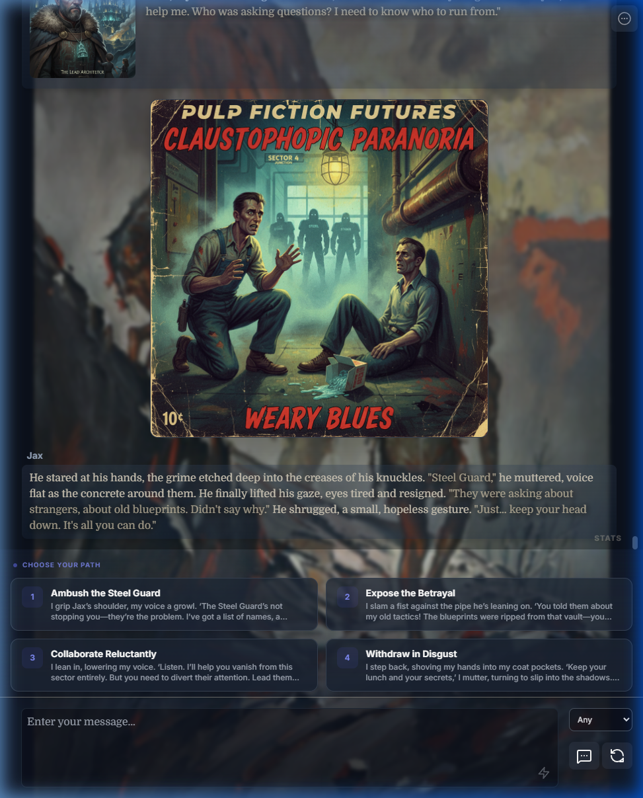

- **Visual Styling**: Fully customizable fonts (Google Fonts), text sizes, and bubble opacity.
- **Ambiance**: Support for background image blur and customizable theme colors to match the tone of your story.
- **Default Settings Sheet**: Override the application default settings globally (UI styles, API keys, parameters) so they automatically apply to every new story.

### AI Painting and Media
- **Beta Music Generation**: Analyze the current scene vibe and automatically generate background instrumental music every N messages using **Lyra 3** (requires Google Gemini API).
- **Image Creation**: The integrated "AI Painter" allows you to generate new character portraits and background images directly within the app using your chosen backend.
- **Text-to-Speech (TTS)**: Built-in TTS support allows for the AI's responses to be read aloud for a more immersive experience.
- **Vision Bridge**: Share a photo with a character even when the model you are writing with is
  text-only. Some of the best writing models simply cannot look at pictures. Turn on the Vision
  Bridge and point it at a model that can — a small local one is plenty — and anything you upload is
  quietly described for your writer behind the scenes. Your character reacts to the picture as if
  they had glanced at it. Nothing about the handoff appears in the story.

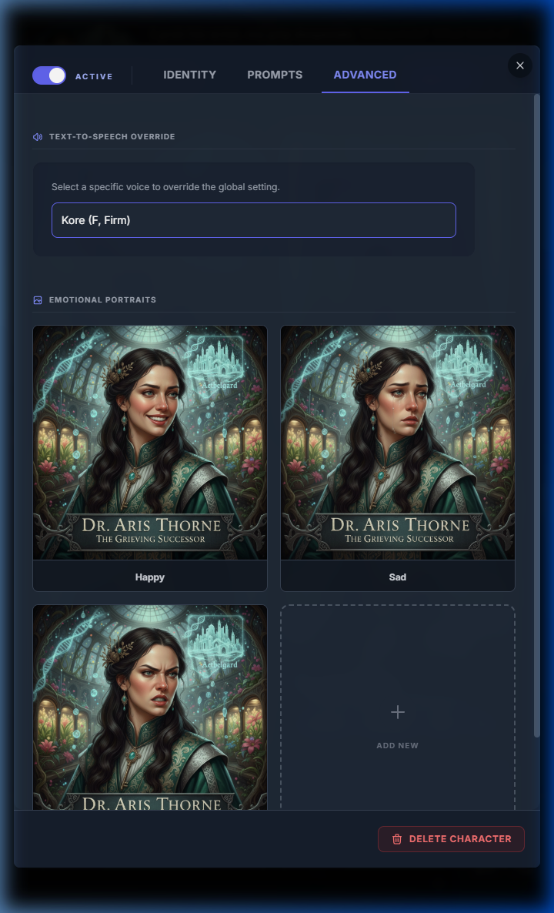

---

## Backends and Privacy

EllipsisLM is backend-agnostic. You can switch between local and cloud models depending on your hardware.

- **Local Models**: Native support for **KoboldCPP** and **LM Studio**. All processing happens on your machine with 100% privacy.
- **Cloud Models**: Support for **Google Gemini** and **OpenRouter** (for access to GPT, Claude, etc.) using your own API keys.

| Feature | Cloud-Only Apps | EllipsisLM |
| :--- | :--- | :--- |
| **Data Privacy** | Conversations may be logged/trained on. | Stored 100% locally. |
| **Content Filtering** | Often restrictive and censored. | No built-in filters; total creative freedom. |
| **Control** | Fixed settings and models. | Complete control over prompts and backend. |
| **Sharing Images** | Uploaded to whoever runs the model. | Can be described by a local model, so the picture never leaves your machine. |
| **Cost** | Monthly subscription fees. | Free for local use or pay-per-token for APIs. |

## Backend Setup Guide

To use EllipsisLM, you need to connect it to an AI model. You can choose between **Cloud APIs** (easiest to set up) or **Local Backends** (completely private and free if you have the hardware). The installed version of EllipsisLM will allow you to automatically download and run KoboldCPP from within the app, so you don't need to manually download or start it separately from EllipsisLM to run locally, and for the html version, you also have the option to run a model fully in your browser using the built-in WebLLM.

### 1. Google Gemini (Cloud)
Google offers a generous free tier for their Gemini models.
1.  Visit **[Google AI Studio](https://aistudio.google.com/)**.
2.  Sign in with your Google account.
3.  Click **"Get API key"** in the left sidebar.
4.  Create a new API key in a new or existing project.
5.  **In EllipsisLM**: Open **Global Settings** (gear icon) > **AI Backend** > Select **Google Gemini** > Paste your key into the **Gemini API Key** field.

* Note: Gemini is necessary for TTS functionality.

### 2. OpenRouter (Cloud)
OpenRouter provides access to dozens of models (Claude, GPT-4, Llama 3) through a single API.
1.  Visit **[OpenRouter Keys](https://openrouter.ai/keys)**.
2.  Sign in and click **"Create Key"**.
3.  Name your key (e.g., "EllipsisLM") and click **"Create"**.
4.  **Copy your key immediately**—you won't be able to see it again.
5.  **In EllipsisLM**: Open **Global Settings** > **AI Backend** > Select **OpenRouter** > Paste your key into the **OpenRouter API Key** field.

* Note: OpenRouter is recommended for the best selection of models and features. There are generous free tiers for many models, and adding $10 in credits will increase free model limits indefinitely, and can last months if use with larger paid models and image generation.

### 3. KoboldCPP (Local)
The preferred local backend for GGUF models on Windows and macOS.
**Note:** The installed version of EllipsisLM will allow you to automatically download and run KoboldCPP from within the app, so you don't need to manually download or start it separately from EllipsisLM.
1.  Download the latest release from the **[Official GitHub](https://github.com/LostRuins/koboldcpp/releases)**.
2.  Launch `koboldcpp.exe`, click **"Browse"** to select your GGUF model file.
3.  Configure your GPU layers (if applicable) and click **"Launch"**.
4.  By default, KoboldCPP runs at `http://localhost:5001`.
5.  **In EllipsisLM**: Open **Global Settings** > **AI Backend** > Select **KoboldCPP**. The **API Base URL** should already be set to `http://localhost:5001`.

* Note: KoboldCPP is the recommended backend for either local text generation or local image generation.

### 4. LM Studio (Local)
A user-friendly local interface for downloading and running models.
1.  Download and install from **[lmstudio.ai](https://lmstudio.ai/)**.
2.  Search for and download a model within the app.
3.  Go to the **"Developer / Local Server"** tab (terminal icon).
4.  Select your model and click **"Start Server"**.
5.  By default, LM Studio runs at `http://localhost:1234`.
6.  **In EllipsisLM**: Open **Global Settings** > **AI Backend** > Select **LM Studio**. Ensure the **LM Studio Server URL** is set to `http://localhost:1234/v1`.

---

### 5. Vision Bridge (Optional)

Only worth setting up if you like a model that cannot see images — DeepSeek and most reasoning
models are in that group. It has no effect on models that already handle pictures themselves.

The idea is simple: keep writing with whatever model you prefer, and let a second model do the
looking. That second model can be a small one running on your own machine, so your pictures never
leave the house even when your writing model is in the cloud.

1. Load any vision-capable model in KoboldCPP or LM Studio. For KoboldCPP that means picking a
   multimodal projector (an `mmproj` file) alongside the model itself.
2. In EllipsisLM, open **Settings → Model** and scroll to **Vision Bridge**.
3. Choose your backend, confirm the address, and press **Test Connection**.
4. If you would rather use a cloud describer, choose OpenRouter and name a vision model.

Now upload an image mid-scene as you normally would. Your character responds to what is in it.

The **Description Instruction** box controls what the describing model is asked to do. The default
aims for vivid, concrete prose. Rewrite it if descriptions come back too clinical, too brief, or
too shy about what is actually in the picture.

If the bridge is off, unreachable, or fails for any reason, nothing breaks — you simply get the old
behaviour, where the character tells you they cannot see the image.

### Connecting to EllipsisLM
Once your backend is running or your API key is ready:
1.  Click the **Global Settings** (gear icon) in the top-right corner of EllipsisLM.
2.  Under the **AI Backend** section, use the dropdown to select your provider.
3.  Input your **API Key** or **Server URL** as required.
4.  For OpenRouter or LM Studio, you can use the **Search / Browse** icons next to the model field to select from available models.

---

## Technical Details

The core of EllipsisLM is a single "monolithic" HTML file containing 23,000+ lines of vanilla JavaScript and CSS. This design choice ensures the application remains portable and dependency-free. There are no external frameworks like React or Vue to manage; the entire state is handled through a custom reactive store.

The codebase is tested via a custom test suite covering format parsing, lore triggering, and story generation stability to prevent regressions. A pre-commit hook automatically enforces technical map modularity across code updates.

The Electron wrapper is a lightweight shell that adds desktop-specific features like auto-updating and local process management for KoboldCPP.

---

## License
EllipsisLM is open-source under the MIT License.
